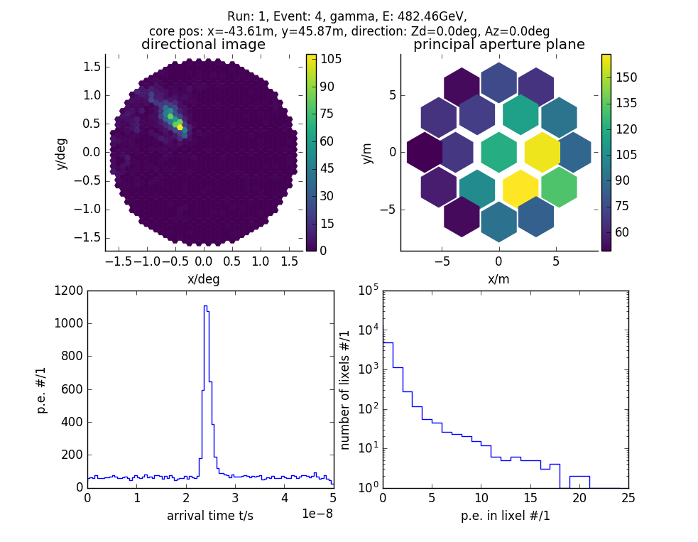

# plenopy

[](https://www.gnu.org/licenses/gpl-3.0)

Read, plot, and investigate the recorded events of the Atmospheric Cherenkov Plenoscope (ACP). Plenopy reads the ACP events written by the ACP simulation mctracer.

## install 
```bash
pip install git+https://github.com/TheBigLebowSky/plenopy/
```


## basic usage
```python
import plenopy as pl

run = pl.Run('plenopy/plenopy/tests/resources/run.acp/')
event = run[3]
event.show()
```

