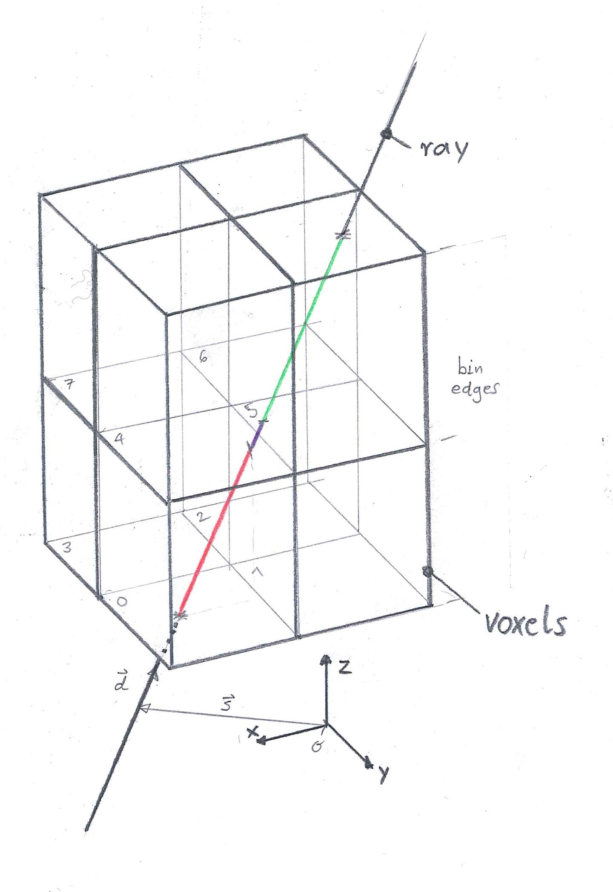

# Overlap of a ray and a volume cell (voxel)

Estimate the distance overlap passed by a ray within a rectangular volume cell (voxel).



For a given, rectangular space partitioning in 3D, and a given ray the overlap of all voxels with the ray is estimated.
The figure shows a ray defined by its support vector and its direction vector which has a non zero overlap with three out of the eight voxels.
A red overlap with voxel ```0```, a purple overlap with voxel ```1```, and a green overlap with voxel ```5```.
 
## Tomography System Matrix

```python
np.random.seed(0)

N_RAYS = 100
supports = np.array([
    np.random.uniform(-2.5, 2.5, N_RAYS),
    np.random.uniform(-2.5, 2.5, N_RAYS),
    np.zeros(100)
]).T

directions = np.array([
    np.random.uniform(-0.3, 0.3, N_RAYS),
    np.random.uniform(-0.3, 0.3, N_RAYS),
    np.ones(100)
]).T

N_X_BINS = 8
N_Y_BINS = 8
N_Z_BINS = 8
psf = pl.tomography.ray_and_voxel.point_spread_function(
    supports=supports, 
    directions=directions, 
    x_bin_edges=np.linspace(-100., 100., N_X_BINS+1), 
    y_bin_edges=np.linspace(-100., 100., N_Y_BINS+1),
    z_bin_edges=np.linspace(0., 200., N_Z_BINS+1),
)
```